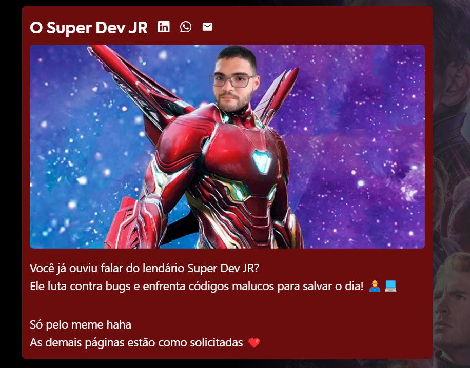

# Desafio Mestres da Web

## Dados do desenvolvedor:

- **Nome** : Luiz Felipe de Souza Barbosa
- **Email** : luizfelipesouza1998@outlook.com

### Redes

---

## Requisitos técnicos solicitados e utilizados
- React.js (Next.js)
- Typescript
- Styled Components & Tailwind
- React Hook Form
- Zod
- Zustand
- Local Storage
- Responsividade
- Organização
- Clean code
- Documentações

## Sobre o desafio

Tentei criar o mais próximo possível do objetivo final.

Resolvi utilizar a abordagem com QueryParams para guardar o estado de qual card está aberto no momento para melhor ux ao compartilhar o link com alguém. 

Foram utilizadas 02 bibliotecas para estilização.
A solicitada `Styled Components` e a `Tailwind` para itens renderizados no server side

### Documentações:

No decorrer do código algumas vezes você irá se deparar com um README.md dentro de alguma pasta.
Gosto bastante da abordagem de criar documentação pra cada componente que possa exigir um pouco mais de atenção na hora de usar. Facilita para todos que estiverem chegando e reduz o tempo de adaptação 😁

Usei também o JSDocs para dar um resuminho na invocação de alguns componentes.

### Como rodar o projeto:

Pela web: 

Se desejar rodar localmente:

- Clone o repositório: `git clone git@github.com:Luiz-F-Souza/desafio_mestres_da_web.git`
- Instale as dependências: `npm install`
- Adicione o env: Copie o arquivo `.env.exemple` para o arquivo `.env.local`
- Inicie o servidor: `npm run dev`

### Alerta de Meme logo abaixo haha

